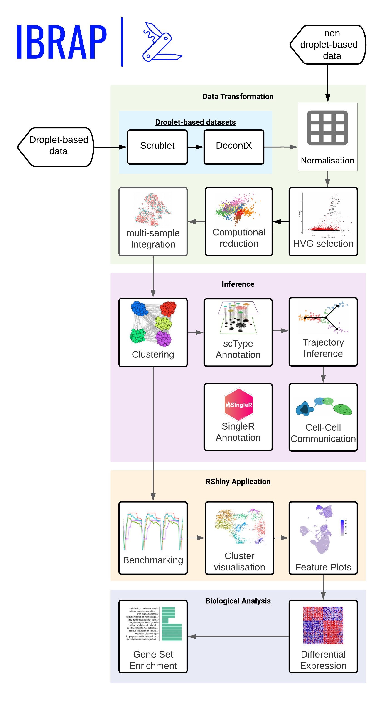
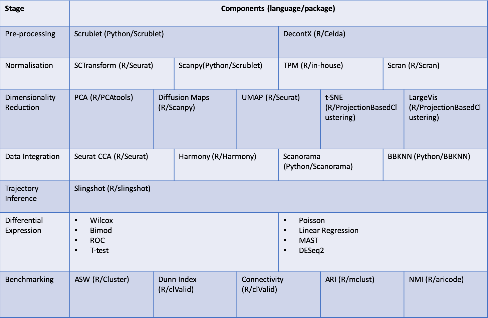

#### Integrated Benchmarking scRNA-seq Analytical Pipeline

IBRAP is an interchangeable scRNA-seq tool that enables personalised pipeline production. We have integrated some of the majorly utilised components across R and Python. 

These tools are incorporated into the following pipeline: 

Our currently integrated tools are the following:

Please observe our range of tutorials to gain a better understanding of IBRAP and how it functions! If you notice any problems, please notify us on our GitHub issues page.
